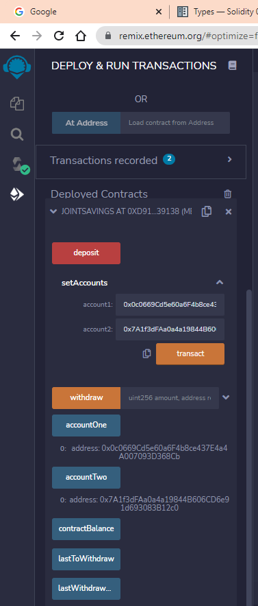
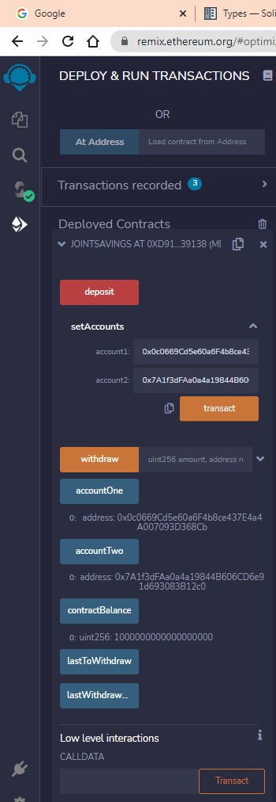
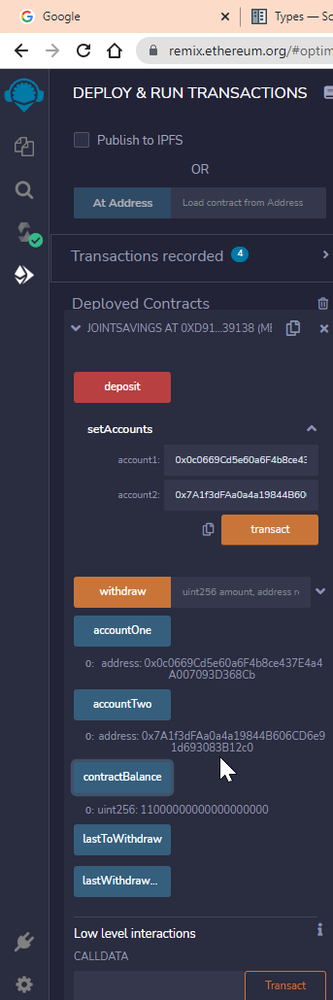
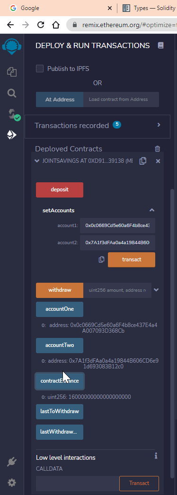
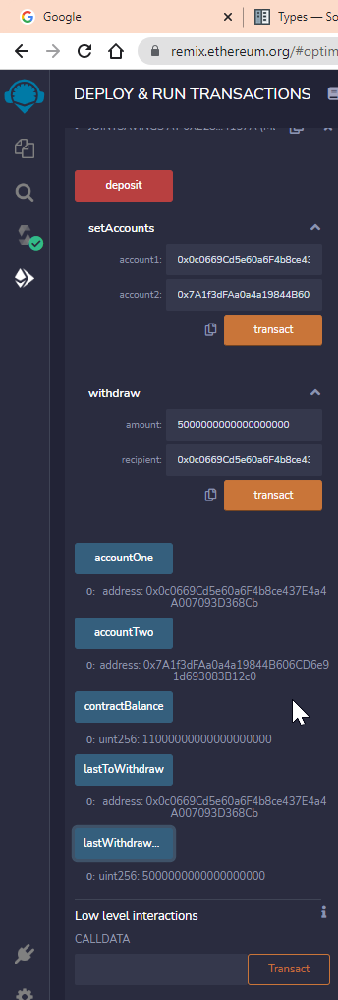
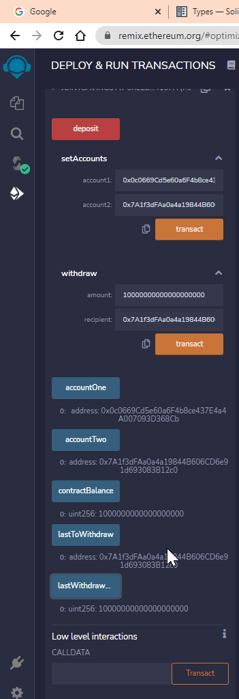

# Unit 20 - "Joint Savings Account"

- - -

# Testing the solidity code

## Setting accounts 
 - I made both the account variables public, so that after setting the addresses can be verified.  
 &nbsp;  
    - Dummy account1 address: 0x0c0669Cd5e60a6F4b8ce437E4a4A007093D368Cb
    - Dummy account2 address: 0x7A1f3dFAa0a4a19844B606CD6e91d693083B12c0  
&nbsp;  

- - -

## Sending Ether to contract

| Transaction 1: Send 1 ether as wei      | Transaction 2: Send 10 ether as wei | Transaction 3: Send 5 ether     |
| :----:        |    :----:   |          :----: |
|       |        |    |

- - -
## Withdrawing Ether from contract to Account1 and Account2

| Withdraw 5ETH to Account1     | Withdraw 10ETH to Account2 |
| :----:        |    :----:   |
|       |        | 
---

